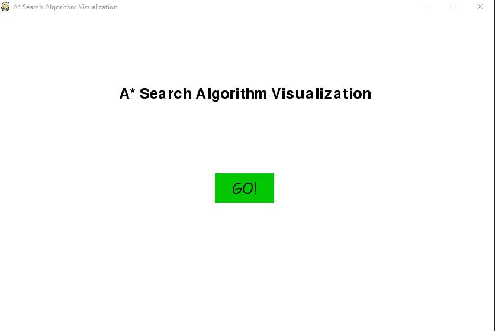
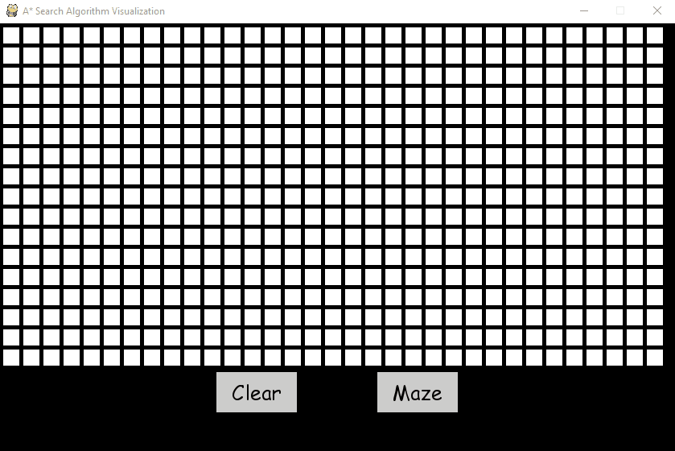

# A* Search Path Finding Algorithm Visualization
A visualization tool for A* search.
## Getting Started
### Requirements
* Python 3.7.3
* Pygame library
## Usage
1. Click leftmouse to put starting point
2. Click leftmouse to put target point
3. Click leftmouse to set obstacle
4. Click space to run path finding algorithm

* By clicking maze, a randomize maze will be generated using recursive division

